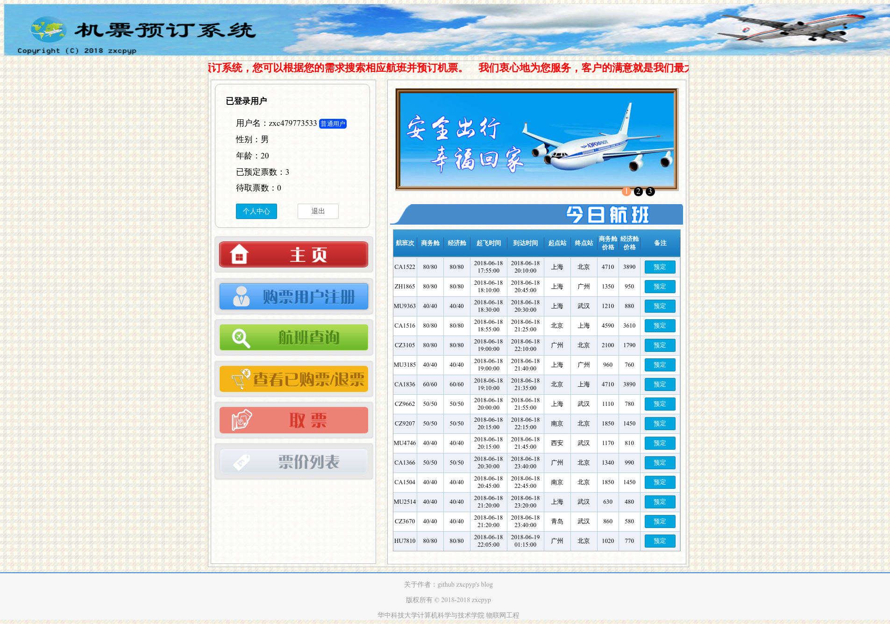

# Ticket booting system

## About

华中科技大学 计算机科学与技术/物联网工程 2018 年春季数据库系统原理课程设计

Copyright © 2018-2018 zxcpyp. Only for reference.

## About SQL query labs

一些简单的SQL操作和备份练习

## Environments

* Archlinux x86_64
* mysql  Ver 15.1 Distrib 10.1.33-MariaDB, for Linux (x86_64)
* PHP 7.2.5

## Details

题目：机票预定系统

开发语言：HTML/CSS + JS + PHP

### Functions

* User
  * 用户可以进行注册和登录
  * 用户可以进入个人空间修改个人信息和密码
  * 用户可以查询航班信息
  * 用户可以查看自己所购买的票和退票
  * 用户可以取票
  * 用户可以查看所有的航班票价列表
  * 实时提醒用户持有票数和今天必须取的票数
* Admin
  * 管理员可以管理用户，修改用户信息或者删除用户
  * 管理员可以查询航班
  * 管理员可以录入新的航班信息
  * 管理员可以删除航班
  * 管理员删除用户的订单
* Backstage
  * 后台有记账表，记录所有用户执行的和金钱有关的操作信息
  * 订单信息和通知信息分两个表存储
  * 用户信息和管理员信息分两个表存储
* Others
  * 航班支持两种类型的票的购买和退票
  * 购买操作只有在用户登录后才可以执行

### Features

* 对所有页面做了严格的权限控制，若未达到可以访问的权限，则跳转回主页
* 对表单的POST做了SQL防注入处理，有一定的安全性

## Index Page

### User

### Admin Page

